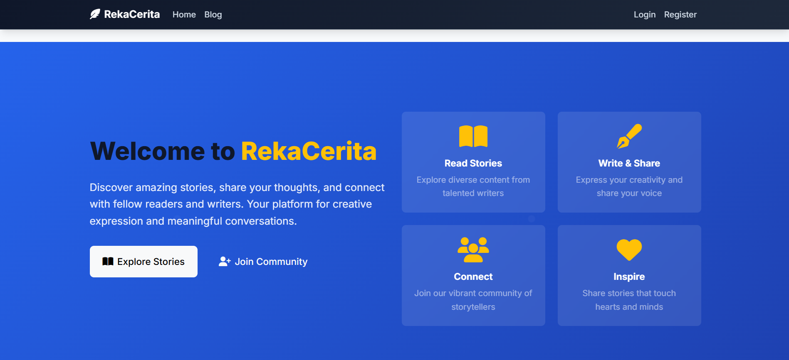
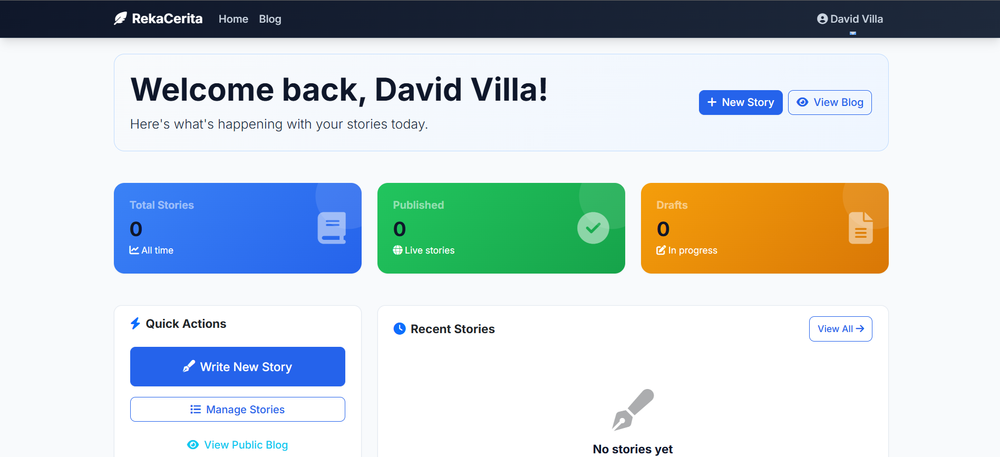
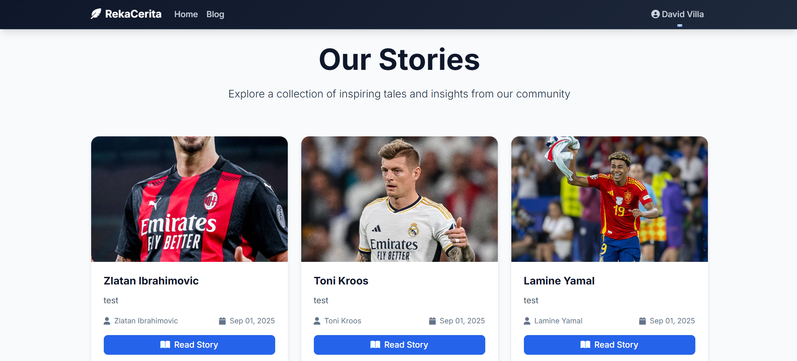

# RekaCerita ✨

> **A modern, production-ready Laravel blog platform with stunning UI/UX design**

RekaCerita (meaning "Story Design" in Malay) is a comprehensive content management platform that combines powerful functionality with beautiful, modern design. Built with Laravel and featuring a custom design system, it provides everything you need to create, manage, and share digital stories.



## ✨ Key Highlights

- 🎨 **Modern UI/UX Design** - Production-ready interface with custom design system
- 🚀 **Performance Optimized** - Fast loading with optimized assets and responsive design
- 📱 **Mobile First** - Fully responsive across all devices
- ♿ **Accessible** - WCAG compliant with proper focus states and keyboard navigation
- 🎯 **User Experience** - Intuitive interface with smooth animations and micro-interactions

## 🎨 Design Features

### Modern Design System
- **Custom CSS Variables** - Consistent theming with design tokens
- **Professional Typography** - Inter & Merriweather font pairing
- **Color Palette** - Modern blue gradient scheme with semantic colors
- **Component Library** - Reusable, consistent UI components
- **Smooth Animations** - Subtle transitions and hover effects

### Enhanced User Interface
- **Hero Section** - Engaging homepage with gradient backgrounds
- **Blog Cards** - Modern card design with hover animations
- **Dashboard** - Beautiful admin interface with statistics cards
- **Navigation** - Smooth, responsive navigation with modern styling
- **Forms** - Enhanced form design with better validation feedback

## 🚀 Features

### 🔐 Authentication System (Built from Scratch)
- User registration with email confirmation
- Secure login/logout with session management
- Password reset via email
- Email verification system
- Role-based access control

### 👥 User Management
- Complete user CRUD operations
- Admin panel with modern interface
- User status and role management
- Enhanced user experience with intuitive controls

### 📝 Content Management
- Rich post creation and editing
- Media upload with gallery support (Spatie Media Library)
- Automatic slug generation (Spatie Sluggable)
- Draft and published status management
- Scheduled publishing capabilities

### 🌐 Public Interface
- **Modern Homepage** - Hero section with feature highlights
- **Blog Listing** - Card-based layout with enhanced typography
- **Post Details** - Optimized reading experience with image galleries
- **Responsive Design** - Perfect on desktop, tablet, and mobile
- **SEO Optimized** - Proper meta tags and semantic HTML

### 📊 Dashboard & Analytics
- **Statistics Overview** - Beautiful cards showing post metrics
- **Quick Actions** - Easy access to common tasks
- **Recent Posts** - Enhanced post management interface
- **User-Friendly** - Intuitive navigation and clear information hierarchy

## 🛠 Technical Stack

### Backend
- **Framework**: Laravel 10
- **Database**: MySQL 8.0+
- **Authentication**: Custom implementation (no packages)
- **Media Handling**: Spatie Media Library
- **Slug Generation**: Spatie Sluggable

### Frontend & Design
- **CSS Framework**: Bootstrap 5 + Custom Design System
- **Build Tool**: Vite (Laravel Mix replacement)
- **Fonts**: Google Fonts (Inter, Merriweather)
- **Icons**: Font Awesome 6
- **Styling**: Modern CSS with Custom Properties
- **Animations**: CSS Transitions & Keyframes

### Development Tools
- **Asset Compilation**: Vite
- **Package Manager**: NPM
- **Version Control**: Git
- **Code Style**: PSR-12 (PHP), Modern CSS practices

## Prerequisites

- PHP 8.1 or higher
- Composer
- MySQL 8.0 or higher
- Node.js & NPM (for asset compilation)

## Installation

1. **Clone the repository**
   ```bash
   git clone <repository-url>
   cd RekaCerita
   ```

2. **Install PHP dependencies**
   ```bash
   composer install
   ```

3. **Install Node.js dependencies**
   ```bash
   npm install
   ```

4. **Environment setup**
   ```bash
   cp .env.example .env
   php artisan key:generate
   ```

5. **Configure database in `.env`**
   ```env
   DB_CONNECTION=mysql
   DB_HOST=127.0.0.1
   DB_PORT=3306
   DB_DATABASE=rekacerita
   DB_USERNAME=your_username
   DB_PASSWORD=your_password
   ```

6. **Configure mail settings in `.env`**
   ```env
   MAIL_MAILER=smtp
   MAIL_HOST=smtp.mailtrap.io
   MAIL_PORT=2525
   MAIL_USERNAME=your_username
   MAIL_PASSWORD=your_password
   MAIL_ENCRYPTION=tls
   MAIL_FROM_ADDRESS="noreply@example.com"
   MAIL_FROM_NAME="${APP_NAME}"
   ```

7. **Create database**
   ```sql
   CREATE DATABASE rekacerita;
   ```

8. **Run migrations**
   ```bash
   php artisan migrate
   ```

9. **Create storage link**
   ```bash
   php artisan storage:link
   ```

10. **Compile assets**
    ```bash
    # For development
    npm run dev

    # For production
    npm run build
    ```

11. **Start the application**
    ```bash
    php artisan serve
    ```

The application will be available at `http://localhost:8000`

## Database Setup

### MySQL Configuration
1. Open MySQL Workbench
2. Create a new database named `rekacerita`
3. Create a new user with appropriate permissions
4. Update the `.env` file with your database credentials

### Database Structure
- **users**: User accounts with roles and verification
- **posts**: Blog posts with media support
- **password_reset_tokens**: Password reset functionality
- **email_verification_tokens**: Email verification system
- **media**: File storage for posts

## 🚀 Getting Started

### First Time Setup
1. **Visit the application** at `http://localhost:8000`
2. **Register a new account** using the modern registration form
3. **Check your email** for the verification link
4. **Verify your email** to activate your account
5. **Login** to access the beautiful dashboard

### Admin Access
- The first user registered automatically becomes an admin
- Admins can manage all users and posts through the enhanced admin interface
- Regular users can only manage their own content

### Creating Your First Story
1. **Login** to your account
2. **Navigate to Dashboard** → Click "Write New Story"
3. **Fill in story details** using the enhanced form interface
4. **Upload media files** (images, documents, videos) - optional
5. **Set status** (Draft/Published) and publishing date
6. **Save** and view your story in the modern blog interface

### Media Management
- **Multiple file support** - Upload multiple images per post
- **Automatic optimization** - Media is processed and optimized
- **Gallery display** - Beautiful image galleries in post views
- **Responsive images** - Automatically sized for different devices

### User Experience Features
- **Modern Dashboard** - Beautiful statistics and quick actions
- **Responsive Design** - Perfect experience on all devices
- **Smooth Animations** - Subtle transitions throughout the interface
- **Accessibility** - Keyboard navigation and screen reader support

## 🔒 Security Features

- **CSRF Protection** - All forms protected against cross-site request forgery
- **Input Validation** - Comprehensive validation and sanitization
- **Password Security** - Bcrypt hashing with secure password policies
- **Session Management** - Secure session handling and timeout
- **Email Verification** - Required email verification for account activation
- **Role-Based Access** - Granular permissions for users and admins
- **XSS Protection** - Output escaping and content security policies

## 📁 Project Structure

```
RekaCerita/
├── app/
│   ├── Http/Controllers/
│   │   ├── AuthController.php      # Authentication logic
│   │   ├── UserController.php      # User management
│   │   ├── PostController.php      # Post management
│   │   └── PublicPostController.php # Public post views
│   ├── Mail/
│   │   ├── EmailVerification.php   # Email verification
│   │   └── PasswordReset.php       # Password reset
│   ├── Models/
│   │   ├── User.php                # User model with media support
│   │   └── Post.php                # Post model with media collections
│   └── Http/Middleware/
│       └── AuthMiddleware.php      # Authentication middleware
├── database/migrations/             # Database structure
├── resources/
│   ├── css/
│   │   └── app.css                 # Modern design system & components
│   ├── js/
│   │   └── app.js                  # Frontend JavaScript
│   └── views/                      # Blade templates
│       ├── auth/                   # Modern authentication views
│       ├── users/                  # Enhanced user management
│       ├── posts/                  # Beautiful post management
│       ├── public/                 # Modern public interface
│       ├── emails/                 # Email templates
│       └── layouts/                # Enhanced layout templates
├── public/build/                   # Compiled assets (Vite)
├── vite.config.js                  # Vite configuration
└── routes/web.php                  # Application routes
```

## 🎨 Design System

The project includes a comprehensive design system with:

- **CSS Custom Properties** - Consistent theming variables
- **Component Library** - Reusable UI components
- **Typography Scale** - Harmonious font sizing
- **Color Palette** - Professional color scheme
- **Spacing System** - Consistent spacing throughout
- **Animation Library** - Smooth transitions and effects

## 🧪 Testing

Run the comprehensive test suite:
```bash
php artisan test
```

For frontend testing:
```bash
npm run test
```

## 🤝 Contributing

RekaCerita welcomes contributions! We appreciate:

- **Bug Reports** - Help us identify and fix issues
- **Feature Requests** - Suggest new functionality
- **Code Contributions** - Submit pull requests
- **Documentation** - Improve our documentation
- **Design Feedback** - Help us enhance the UI/UX

Please follow the existing code style and structure when submitting pull requests.

## 📸 Screenshots

### Modern Homepage


### Enhanced Dashboard


### Blog Interface


## 🚀 Deployment

### Production Checklist
- [ ] Set `APP_ENV=production` in `.env`
- [ ] Configure proper database credentials
- [ ] Set up mail service (SendGrid, Mailgun, etc.)
- [ ] Run `npm run build` for optimized assets
- [ ] Configure web server (Apache/Nginx)
- [ ] Set up SSL certificate
- [ ] Configure backup strategy

### Performance Tips
- Enable **OPcache** for PHP
- Use **Redis** for session storage
- Configure **CDN** for static assets
- Enable **Gzip compression**
- Set up **database indexing**

## 📄 License

This project is open source and available under the **MIT License**.

## 💬 Support & Community

- **GitHub Issues** - Report bugs and request features
- **Documentation** - Comprehensive guides and API docs
- **Community** - Join our growing community of developers

---

**Built with ❤️ using Laravel and modern web technologies**

*RekaCerita - Where stories come to life with beautiful design*
